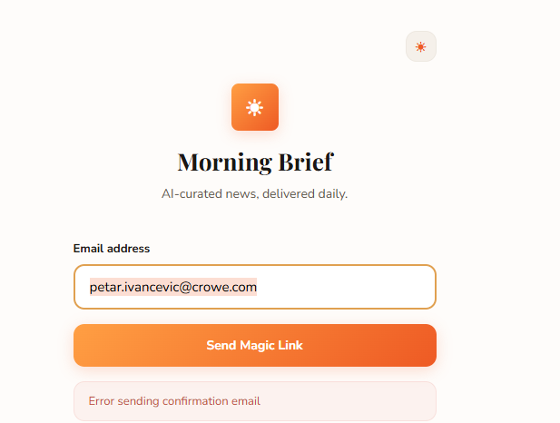
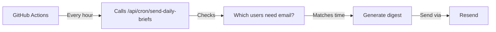

# GitHub Actions Setup (FREE Alternative)

This guide explains how to use **GitHub Actions** (completely free) instead of Vercel Cron for scheduled email delivery.

## ✅ Why GitHub Actions?

- **100% FREE** - No paid plan required
- **Reliable** - Runs on GitHub's infrastructure
- **Same functionality** - Works exactly like Vercel Cron
- **Easy setup** - Just add secrets and push

---

## 🚀 Quick Setup (3 Steps)

### Step 1: Add Secrets to GitHub

1. Go to your GitHub repo: https://github.com/petar-ivancevic/morning-brief
2. Click **Settings** → **Secrets and variables** → **Actions**
3. Click **"New repository secret"**
4. Add these secrets:

#### Secret 1: CRON_SECRET
```
Name: CRON_SECRET
Value: (generate with: openssl rand -base64 32)
```

#### Secret 2: VERCEL_URL
```
Name: VERCEL_URL
Value: https://morning-brief-xxx.vercel.app
```
(Replace with your actual Vercel URL)

### Step 2: Push to GitHub

The workflow file is already in your repo at `.github/workflows/daily-brief.yml`

Just push your changes:
```bash

```

### Step 3: Enable Actions (if needed)

1. Go to your repo → **Actions** tab
2. If prompted, click **"I understand my workflows, go ahead and enable them"**
3. You should see the "Send Daily Briefs" workflow listed

---

## 🧪 Testing

### Manual Test

1. Go to repo → **Actions** tab
2. Click **"Send Daily Briefs"** workflow
3. Click **"Run workflow"** button
4. Select branch: **main**
5. Click **"Run workflow"**
6. Wait 10-20 seconds
7. Click on the running workflow to see logs

### Check Logs

1. Go to **Actions** tab
2. Click on a workflow run
3. Click on **"send-briefs"** job
4. Expand **"Send scheduled briefs"** step
5. See the response from your API

---

## 📅 Schedule

The workflow runs **every hour at minute 0**:
- 12:00 AM, 1:00 AM, 2:00 AM, ...
- 8:00 AM (your delivery time), 9:00 AM, ...
- etc.

Your cron endpoint checks if it's the user's delivery time and sends accordingly.

---
## 🔧 How It Works



1. **GitHub Actions** triggers every hour
2. **Calls your API** endpoint with CRON_SECRET
3. **API checks** which users have email_delivery enabled
4. **Matches time** with user's delivery_time
5. **Generates** and **sends** emails

---

## 💰 Cost

**GitHub Actions is FREE for public repos!**

For private repos:
- **Free:** 2,000 minutes/month
- **Each run:** ~1 minute
- **Monthly usage:** 24 runs/day × 30 days = 720 minutes
- **Well within free tier!** ✅

---

## 🔒 Security

### Secrets are Secure:
- ✅ Never exposed in logs
- ✅ Encrypted at rest
- ✅ Only accessible during workflow runs
- ✅ Can't be read by anyone (including you!)

### CRON_SECRET:
- Prevents unauthorized calls to your cron endpoint
- Only GitHub Actions has access
- Must match in your Vercel environment variables

---

## 🐛 Troubleshooting

### Workflow Not Running

**Check:**
1. Go to repo → **Settings** → **Actions** → **General**
2. Ensure "Allow all actions and reusable workflows" is enabled
3. Check that workflow file is in `.github/workflows/` directory

### API Call Failing

**Check:**
1. Secrets are set correctly in GitHub
2. VERCEL_URL is your actual deployment URL
3. CRON_SECRET matches in Vercel environment variables
4. API endpoint is deployed and working

**Test manually:**
```bash
curl -X POST https://your-app.vercel.app/api/cron/send-daily-briefs \
  -H "Authorization: Bearer YOUR_CRON_SECRET"
```

### No Emails Sending

**Check:**
1. User has `email_delivery = true` in database
2. User's `delivery_time` matches current UTC hour
3. RESEND_API_KEY is set in Vercel
4. Domain is verified in Resend
5. Check Vercel function logs for errors

---

## 📊 Monitoring

### GitHub Actions Logs

1. Go to **Actions** tab
2. See all workflow runs (hourly)
3. Click any run to see details
4. Green ✅ = Success
5. Red ❌ = Failed (check logs)

### Vercel Function Logs

1. Go to Vercel → Deployments → Functions
2. Find `/api/cron/send-daily-briefs`
3. View logs to see:
   ```
   Found 2 users with email delivery enabled
   ✓ Sent brief to user@example.com
   Processed: 2, Sent: 2, Errors: 0
   ```

### Resend Dashboard

- See all sent emails
- Check delivery status
- Monitor opens/clicks

---

## 🎯 Advantages over Vercel Cron

| Feature | GitHub Actions | Vercel Cron |
|---------|----------------|-------------|
| Cost | FREE ✅ | $20/month |
| Reliability | High ✅ | High ✅ |
| Setup | Easy ✅ | Easy ✅ |
| Logs | Visible ✅ | Requires Pro |
| Manual trigger | Yes ✅ | No |
| Public repos | Free forever ✅ | Paid |

---

## 🔄 Workflow File

Location: `.github/workflows/daily-brief.yml`

```yaml
name: Send Daily Briefs

on:
  schedule:
    - cron: '0 * * * *'  # Every hour
  workflow_dispatch:  # Manual trigger

jobs:
  send-briefs:
    runs-on: ubuntu-latest
    steps:
      - name: Send scheduled briefs
        run: |
          curl -X POST ${{ secrets.VERCEL_URL }}/api/cron/send-daily-briefs \
            -H "Authorization: Bearer ${{ secrets.CRON_SECRET }}" \
            --fail-with-body
```

---

## ✅ Setup Checklist

- [ ] Generate CRON_SECRET (`openssl rand -base64 32`)
- [ ] Add CRON_SECRET to GitHub Secrets
- [ ] Add VERCEL_URL to GitHub Secrets
- [ ] Add CRON_SECRET to Vercel Environment Variables
- [ ] Push workflow file to GitHub
- [ ] Enable GitHub Actions (if needed)
- [ ] Test with "Run workflow" button
- [ ] Check logs for success
- [ ] Wait for scheduled run (next hour)
- [ ] Verify email delivery works

---

## 🎉 You're Done!

Your scheduled email delivery now runs **100% free** using GitHub Actions!

**Next Steps:**
1. Add the two secrets to GitHub
2. Add CRON_SECRET to Vercel
3. Push to GitHub
4. Test manually
5. Check your inbox at delivery time!

---

**Questions?** Check the Actions tab logs or Vercel function logs for debugging.
