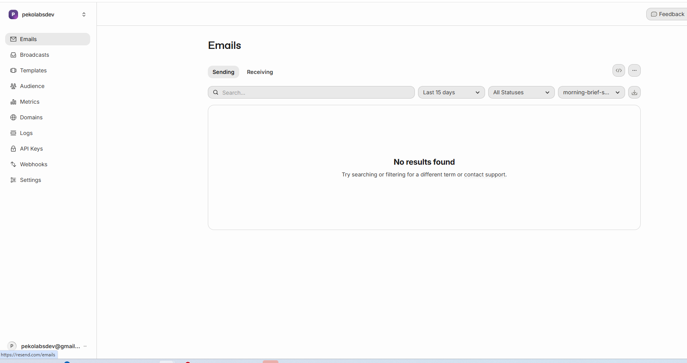

# Resend Email Setup with petarivancevic.com

This guide will help you set up Resend for sending professional magic link emails from your own domain.

## 🎯 What You'll Get

- **From:** Morning Brief <noreply@petarivancevic.com>
- **Professional branding** with your domain
- **Better deliverability** (less likely to go to spam)
- **3,000 free emails/month** (plenty for magic links)
- **Email analytics** and tracking

## 🚀 Step 1: Sign Up for Resend

1. Go to [resend.com](https://resend.com)
2. Click "Get Started"
3. Sign up with your email or GitHub
4. Verify your email address

## 📧 Step 2: Add Your Domain

1. In Resend dashboard, click **"Domains"**
2. Click **"Add Domain"**
3. Enter: `petarivancevic.com`
4. Click **"Add"**

## 🔧 Step 3: Configure DNS Records

Resend will show you DNS records to add. You need to add these to your domain's DNS settings (wherever you manage petarivancevic.com).

### DNS Records to Add:

**1. SPF Record (TXT)**
```
Type: TXT
Name: @
Value: v=spf1 include:resend.com ~all
TTL: 3600
```

**2. DKIM Record (TXT)**
```
Type: TXT
Name: resend._domainkey
Value: (Resend will provide this - copy exactly)
TTL: 3600
```

**3. DMARC Record (TXT)** _(Optional but recommended)_
```
Type: TXT
Name: _dmarc
Value: v=DMARC1; p=none; rua=mailto:dmarc@petarivancevic.com
TTL: 3600
```

### Where to Add DNS Records:

Depending on where your domain is hosted:

**GoDaddy:**
1. Go to DNS Management
2. Add each record above

**Cloudflare:**
1. Go to DNS settings
2. Add Records → Add each TXT record

**Namecheap:**
1. Advanced DNS
2. Add New Record → Select TXT

**Google Domains:**
1. DNS → Custom records
2. Create new record for each

### Verify DNS Records

1. After adding DNS records, wait 5-15 minutes
2. Go back to Resend dashboard
3. Click **"Verify"** next to your domain
4. Status should change to **"Verified" ✅**

## 🔑 Step 4: Get Your Resend API Key

1. In Resend dashboard, go to **"API Keys"**
2. Click **"Create API Key"**
3. Name it: `morning-brief-production`
4. Permissions: **"Full access"** (or "Sending access")
5. Click **"Create"**
6. **Copy the API key** (starts with `re_...`)
7. **Save it securely** - you won't see it again!

## 🔐 Step 5: Update Environment Variables

### Local Development (.env)

Update your `.env` file:

```env
# Supabase Configuration
VITE_SUPABASE_URL=https://fmsfhmomortenevikqao.supabase.co
VITE_SUPABASE_ANON_KEY=eyJhbGciOiJIUzI1NiIsInR5cCI6IkpXVCJ9...

# OpenAI API Key
OPENAI_API_KEY=sk-proj-...

# Resend API Key
RESEND_API_KEY=re_... (your Resend API key)
```

### Vercel Deployment

Add to Vercel Environment Variables:
1. Go to Vercel project settings
2. Environment Variables
3. Add new variable:
   - **Name:** `RESEND_API_KEY`
   - **Value:** `re_...` (your Resend API key)
   - **Environments:** Production, Preview, Development

## 📬 Step 6: Configure Supabase to Use Resend

### Option A: Use Resend SMTP (Recommended for Supabase)

1. Go to Supabase Project Settings → Auth
2. Scroll to **"SMTP Settings"**
3. Enable **"Enable Custom SMTP"**
4. Configure:

```
Host: smtp.resend.com
Port: 465 (SSL) or 587 (TLS)
Username: resend
Password: (Your Resend API Key - re_...)
Sender Email: noreply@petarivancevic.com
Sender Name: Morning Brief
```

5. Click **"Save"**

### Option B: Use Resend API Directly (More Control)

If you want more control, you can send emails directly via Resend API instead of going through Supabase SMTP. This is more advanced but gives you better customization.

## 📝 Step 7: Customize Email Templates

### Update Supabase Email Templates

1. Go to **Authentication** → **Email Templates**
2. Select **"Magic Link"** template
3. Update with your branding:

```html
<!DOCTYPE html>
<html>
<head>
  <style>
    body { font-family: -apple-system, BlinkMacSystemFont, 'Segoe UI', sans-serif; }
    .container { max-width: 600px; margin: 0 auto; padding: 40px 20px; }
    .header { text-align: center; margin-bottom: 40px; }
    .logo { font-size: 32px; font-weight: bold; color: #ee5a24; }
    .button {
      display: inline-block;
      padding: 14px 32px;
      background: linear-gradient(135deg, #ff9f43, #ee5a24);
      color: white;
      text-decoration: none;
      border-radius: 8px;
      font-weight: 600;
    }
    .footer { margin-top: 40px; color: #666; font-size: 14px; text-align: center; }
  </style>
</head>
<body>
  <div class="container">
    <div class="header">
      <div class="logo">☀ Morning Brief</div>
    </div>

    <h2>Sign in to Your Morning Brief</h2>
    <p>Click the button below to sign in to your account:</p>

    <p style="text-align: center; margin: 32px 0;">
      <a href="{{ .ConfirmationURL }}" class="button">Sign In</a>
    </p>

    <p style="color: #666; font-size: 14px;">
      Or copy and paste this URL into your browser:<br>
      <a href="{{ .ConfirmationURL }}">{{ .ConfirmationURL }}</a>
    </p>

    <p style="color: #666; font-size: 14px;">
      This link expires in 60 minutes.
    </p>

    <div class="footer">
      <p>Sent from <strong>petarivancevic.com</strong></p>
      <p>If you didn't request this email, you can safely ignore it.</p>
    </div>
  </div>
</body>
</html>
```

## 🧪 Step 8: Test Email Sending

### Test from Resend Dashboard

1. Go to Resend → **"Emails"**
2. Click **"Send Test Email"**
3. Enter your email
4. Send and verify you receive it

### Test from Your App

1. Run your app locally: `npm run dev`
2. Go to http://localhost:5173
3. Enter your email on the login page
4. Click "Send Magic Link"
5. Check your email inbox
6. Verify the email comes from `noreply@petarivancevic.com`
7. Click the magic link to sign in

## 📊 Step 9: Monitor Email Delivery

### Resend Dashboard

- Go to **"Emails"** to see all sent emails
- View delivery status, opens, clicks
- Check bounce and spam reports

### Common Issues:

**Emails going to spam:**
- Make sure DNS records are properly verified
- Add DMARC policy
- Warm up your domain by sending to yourself first

**Emails not sending:**
- Verify domain in Resend dashboard
- Check API key is correct
- Check SMTP credentials in Supabase

## 💰 Pricing & Limits

### Resend Free Tier:
- **3,000 emails/month** (free)
- **100 emails/day**
- Perfect for magic links!

### If you need more:
- **Pro Plan:** $20/month = 50,000 emails
- **Enterprise:** Custom pricing

### Estimate for Your App:
- Average user: 2-3 magic links/month
- 1,000 users = ~3,000 emails/month
- **Free tier is plenty!**

## 🔒 Security Best Practices

1. **Never commit API keys** - Already in .gitignore ✅
2. **Use environment variables** - Configured ✅
3. **Rotate keys periodically** - Every 6-12 months
4. **Monitor for abuse** - Check Resend dashboard weekly
5. **Rate limit requests** - Already configured in Supabase ✅

## 🎨 Email Sender Options

You can use different email addresses:

- `noreply@petarivancevic.com` (Recommended - clear purpose)
- `brief@petarivancevic.com` (Short and branded)
- `morning@petarivancevic.com` (Thematic)
- `petar@petarivancevic.com` (Personal touch)

Choose one and use it consistently in:
1. Resend SMTP settings
2. Supabase email templates
3. Email template "from" field

## 🆘 Troubleshooting

### DNS not verifying
- Wait 30-60 minutes for DNS propagation
- Use [MXToolbox](https://mxtoolbox.com/SuperTool.aspx) to check records
- Make sure no conflicting SPF records exist

### SMTP connection failed
- Double-check username is `resend`
- Password is your full API key (starts with `re_`)
- Try both ports: 465 (SSL) and 587 (TLS)

### Emails not delivered
- Check Resend dashboard for delivery status
- Verify domain status is "Verified"
- Check spam folder
- Verify sender email matches your domain

## 📚 Resources

- [Resend Docs](https://resend.com/docs)
- [Resend SMTP Guide](https://resend.com/docs/send-with-smtp)
- [DNS Configuration Help](https://resend.com/docs/dashboard/domains/introduction)
- [Email Best Practices](https://resend.com/docs/dashboard/domains/dmarc)

## ✅ Checklist

- [ ] Sign up for Resend
- [ ] Add petarivancevic.com domain
- [ ] Configure DNS records (SPF, DKIM, DMARC)
- [ ] Verify domain in Resend
- [ ] Get Resend API key
- [ ] Update .env with RESEND_API_KEY
- [ ] Configure Supabase SMTP settings
- [ ] Customize email templates
- [ ] Test magic link email locally
- [ ] Add RESEND_API_KEY to Vercel
- [ ] Test in production
- [ ] Monitor first 100 emails

---

🎉 **Once complete, your users will receive beautiful, professional magic link emails from your own domain!**
